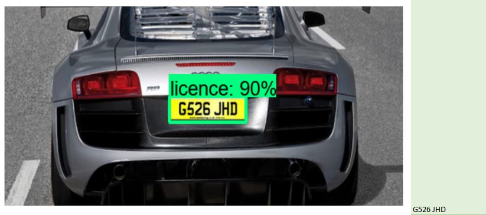

# Car Plate Number Recognition Project


## Contents
1. [Introduction](#Introduction)
2. [Relevant Repositories](#relevant-repositories)
3. [Installation Instructions](#installation-instructions)
4. [Usage Instructions](#usage-instructions)
5. [Results](#results)
6. [Acknowledgement](#acknowledgement)

## 1. Introduction

This project provides a solution for **Car Plate Number Recognition**. It works in two main stages:

1. **Object Detection**: The system first identifies car plates using a model trained on 
[Kaggle Dataset](https://www.kaggle.com/datasets/andrewmvd/car-plate-detection)
2. **Text Extraction**: Once a car plate is detected and marked, **EasyOCR** is employed to extract the car plate number.
All extracted numbers are then compiled and saved into a CSV file.



## 2. Relevant Repositories

- My previous repository as base: [Object Detection](https://github.com/NguyenToanLe/Object_Detection)
- TF Record Generator: [Generator from nicknochnack](https://github.com/nicknochnack/GenerateTFRecord)
- Models: [TensorFlow Model Garden](https://github.com/tensorflow/models/tree/master)
- Utilized model: [TensorFlow model Zoo tf2 - SSD MobileNet V2 FPNLite 320x320](https://github.com/tensorflow/models/blob/master/research/object_detection/g3doc/tf2_detection_zoo.md)


## 3. Installation Instructions

- I used:
  - Windows 10
  - Python v3.10.3
  - Protobuf v3.8.0
  - CUDA v11.2 and Cudnn v8.1
  - TensorFlow v2.10.1
- I trained the model on an NVIDIA GeForce GTX 1660 with 6GB of memory.

### Install and activate virtual environment
First go to a directory, where you want to save your project. Then open terminal. Here I named my virtual environment 
`venv_cpr`. You can change this name as the one you want.
```python
python -m venv venv_cpr
.\venv_cpr\Scripts\activate
python -m pip install --upgrade pip
```

### Clone some necessary repositories
```python
git clone https://github.com/NguyenToanLe/Object_Detection.git
git clone https://github.com/tensorflow/models.git
```

### Install requirements for Object Detection
#### Step 1: Download, extract and add protoc (bin) to Environment Variable
Follow the instruction 
[here](https://github.com/protocolbuffers/protobuf/releases/tag/v3.8.0)

#### Step 2: Install Tensorflow Object Detection API
NOTICE: Install in terminal, NOT in IDE
```python
cd .\models\research
protoc object_detection\protos\*.proto --python_out=.
copy object_detection\packages\tf2\setup.py .
pip install .
python setup.py build
python setup.py install
cd .\slim
pip install -e .
```

#### Step 3: Install CUDA and Cudnn

- Follow instructions in these two links from tensorflow:
  - https://www.tensorflow.org/install/source
  - https://www.tensorflow.org/install/pip
- During Verification of CUDA and Cudnn, these command might be helpful:
```python
pip install --upgrade --force-reinstall zstandard
python -c "import zstandard as zstd; print(zstd.__version__)"
```

#### Step 4: Download model

- Here, I used TensorFlow model Zoo tf2 - SSD MobileNet V2 FPNLite 320x320, which can be found and downloaded 
[here](https://github.com/tensorflow/models/blob/master/research/object_detection/g3doc/tf2_detection_zoo.md)
- You can create a new directory in the root folder by using these commands
```python
cd ..\..\..\
mkdir pretrained_model
```
- You download the model you want in this new folder, extract it there

#### Step 5: Create some useful folders
```python
mkdir custom_model
cd custom_model
mkdir train
mkdir eval 
cd ..
```

## 4. Usage Instructions

To get started, you'll primarily interact with `run.py`. This versatile script allows you to:

- **Train models**: Use your pre-defined structured datasets to train the object detector.
- **Run inference or tests**: Make extractions on an image set.

### TRAINING MODE

The `run.py` script offers several arguments in training mode to fine-tune its behavior. Here's a breakdown:

- `--is_train`: Use this flag to switch between *training* and *inference* mode. By default, the script runs in
inference mode.
- `--image_path`: When in this training mode, this argument needs to point to a folder that should have the following 
structure:
    ```
    your_image_path/
    ├── images/
    │   ├── image1.jpg
    │   ├── image2.png
    │   └── ...
    └── annotations/
        ├── image1.xml
        ├── image2.xml
        └── ...
    ```
- `--train`: This argument controls the training data split ratio. By default, 80% of your data (`0.8`) is allocated for 
training.
- `--batch_size`: Set the batch size for model training. The default value is `5`.
- `--num_steps`: Determine the number of training steps. It's set to `13000` by default.


```python
python run.py --is_train --img_path <your/image/path> --train 0.8 --batch_size 5 --num_steps 13000
```


### INFERENCE / TEST MODE

When running `run.py` in *inference / test* mode, you only need to define the `--image_path` argument. In this case, the
path should simply point to a directory containing all the images you wish to process.

For example:
  ```
  your_image_path/
  ├── images/
      ├── image1.jpg
      ├── image2.png
      └── ...
  ```

```python
python run.py --img_path <your/image/path>
```

After processing, the script saves the results in the following locations:

- **Images with Bounding boxes**: Images with detected bounding boxes will be saved to `./dataset/results/bbox`.
- **Extracted car plate numbers**: A CSV file containing all extracted car plate numbers will be saved to `./dataset/results`.


## 5. Results

This repository serves as a foundation for exploring car plate detection and OCR. For educational and research purposes, 
the current hyper-parameters and the EasyOCR setup are intentionally not fully optimized.

Preliminary tests on 87 images provide the following insights into the current performance:

- **Plate Detection Accuracy**: 71.26%
- **OCR Extraction Accuracy (EasyOCR)**: 68.97%

While these results offer a starting point, achieving real-world deployment capabilities would necessitate comprehensive
optimization and fine-tuning across both the object detection pipeline and the OCR process. This project provides a 
strong basis for such future improvements.

## 6. Acknowledgement

I would like to thank the authors [Nicholas Renotte](https://github.com/nicknochnack/TFODCourse), 
[labelImg](https://github.com/HumanSignal/labelImg) and [TensorFlow](https://github.com/tensorflow/models/tree/master) 
of for releasing their helpful codebases.
